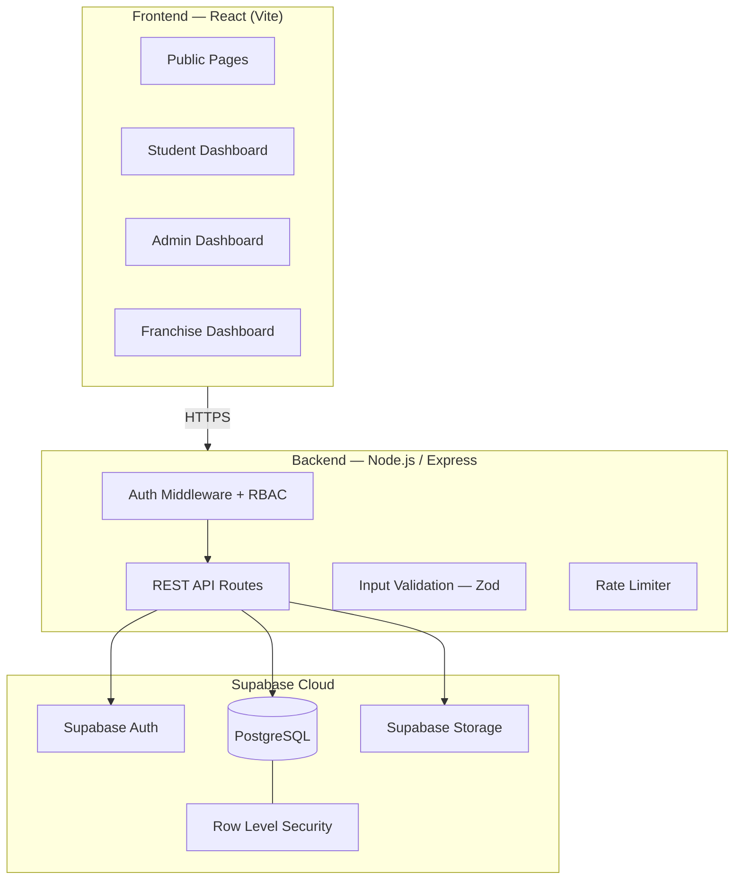
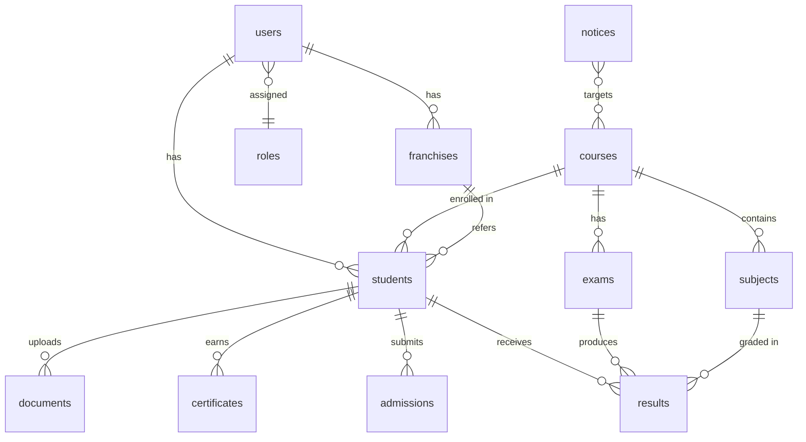
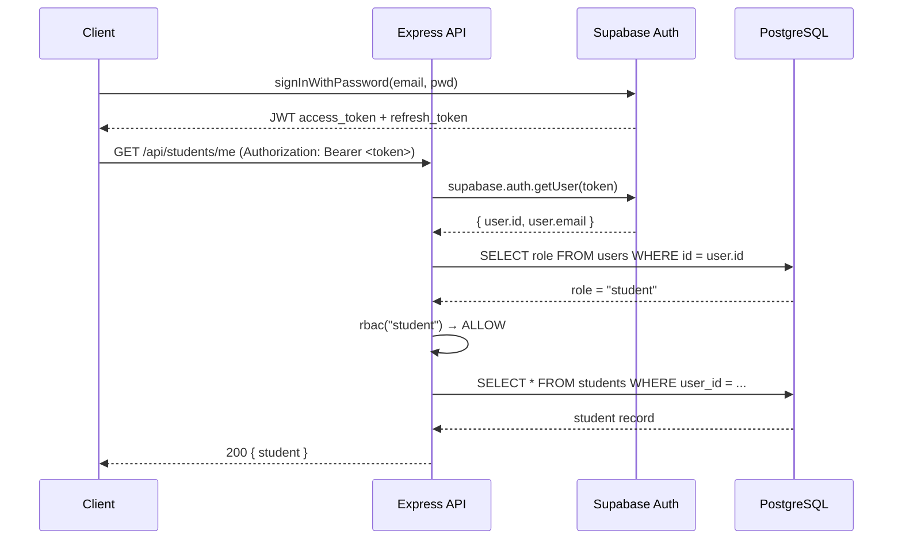

# EduCare — System Architecture & Implementation Plan

A production-ready digital platform for a healthcare & nursing training institute, supporting student admissions, exams, results, certificates, notices, and franchise management.

---

## 1. High-Level Architecture



### Why this split?

| Decision | Rationale |
|---|---|
| **Dedicated Express API** | Gives full control over route logic, rate limiting, and complex business rules (e.g. certificate generation, PDF creation). Avoids relying solely on Supabase client-side calls which would expose business logic. |
| **Supabase Auth** | Ready-made JWT auth, password reset flows, session management. No need to build from scratch. |
| **Supabase Storage** | Managed file storage with per-bucket policies — ideal for documents, photos, certificates. |
| **Row Level Security** | Defense-in-depth — even if a bug leaks a Supabase service key, RLS policies ensure data isolation. |
| **Zod validation** | Runtime schema validation ensures every request payload is type-safe before it reaches the DB. |

---

## 2. Folder Structure

```
edu-web-portal/
├── client/                         # React frontend (Vite)
│   ├── public/
│   ├── src/
│   │   ├── assets/                 # images, fonts
│   │   ├── components/             # reusable UI components
│   │   │   ├── ui/                 # buttons, inputs, modals, cards
│   │   │   ├── layout/             # Header, Footer, Sidebar, DashboardLayout
│   │   │   └── forms/              # AdmissionForm, FranchiseForm, ExamForm
│   │   ├── pages/
│   │   │   ├── public/             # Home, About, Courses, Contact, Notices, Verify
│   │   │   ├── auth/               # Login, Register, ForgotPassword
│   │   │   ├── admin/              # Dashboard, Students, Exams, Results, Notices, Certs, Franchises
│   │   │   ├── student/            # Dashboard, Profile, Exams, Results, Certificates
│   │   │   └── franchise/          # Dashboard, Students, Admissions
│   │   ├── hooks/                  # useAuth, useFetch, useRole
│   │   ├── context/                # AuthContext, ThemeContext
│   │   ├── services/               # api.js (axios instance), supabaseClient.js
│   │   ├── utils/                  # helpers, constants, formatters
│   │   ├── routes/                 # AppRouter, ProtectedRoute, RoleRoute
│   │   ├── styles/                 # index.css, variables.css, components.css
│   │   ├── App.jsx
│   │   └── main.jsx
│   ├── index.html
│   ├── vite.config.js
│   └── package.json
│
├── server/                         # Express backend
│   ├── src/
│   │   ├── config/                 # supabase.js, env.js
│   │   ├── middleware/             # auth.js, rbac.js, rateLimiter.js, validate.js
│   │   ├── routes/
│   │   │   ├── auth.routes.js
│   │   │   ├── students.routes.js
│   │   │   ├── admissions.routes.js
│   │   │   ├── exams.routes.js
│   │   │   ├── results.routes.js
│   │   │   ├── notices.routes.js
│   │   │   ├── certificates.routes.js
│   │   │   ├── franchises.routes.js
│   │   │   ├── courses.routes.js
│   │   │   └── admin.routes.js
│   │   ├── controllers/            # one controller per route file
│   │   ├── validators/             # Zod schemas per entity
│   │   ├── utils/                  # pdf.js, idGenerator.js, helpers.js
│   │   └── app.js                  # Express app setup
│   ├── server.js                   # entry point
│   └── package.json
│
├── supabase/
│   └── migrations/                 # SQL migration files
│       ├── 001_create_roles.sql
│       ├── 002_create_users.sql
│       ├── 003_create_courses.sql
│       ├── 004_create_students.sql
│       ├── 005_create_admissions.sql
│       ├── 006_create_exams.sql
│       ├── 007_create_subjects.sql
│       ├── 008_create_results.sql
│       ├── 009_create_notices.sql
│       ├── 010_create_certificates.sql
│       ├── 011_create_franchises.sql
│       ├── 012_create_documents.sql
│       ├── 013_create_rls_policies.sql
│       └── 014_create_indexes.sql
│
├── .env.example
├── .gitignore
└── README.md
```

---

## 3. Database Schema



### Table Definitions

#### `roles`
| Column | Type | Notes |
|---|---|---|
| id | uuid PK | |
| name | text UNIQUE | `admin`, `student`, `franchise` |
| created_at | timestamptz | default `now()` |

#### `users`
| Column | Type | Notes |
|---|---|---|
| id | uuid PK | matches Supabase `auth.users.id` |
| email | text UNIQUE | |
| full_name | text | |
| role_id | uuid FK → roles | |
| avatar_url | text | nullable |
| is_active | boolean | default `true` |
| created_at | timestamptz | |
| updated_at | timestamptz | |

#### `courses`
| Column | Type | Notes |
|---|---|---|
| id | uuid PK | |
| name | text | |
| slug | text UNIQUE | URL-friendly |
| description | text | |
| duration_months | int | |
| fee | numeric(10,2) | |
| is_active | boolean | default `true` |
| created_at / updated_at | timestamptz | |

#### `students`
| Column | Type | Notes |
|---|---|---|
| id | uuid PK | |
| user_id | uuid FK → users | |
| student_id_number | text UNIQUE | Generated (e.g. `STU-2026-0001`) |
| course_id | uuid FK → courses | |
| franchise_id | uuid FK → franchises | nullable |
| date_of_birth | date | |
| gender | text | |
| phone | text | |
| address | text | |
| city | text | |
| state | text | |
| pincode | text | |
| enrollment_date | date | |
| status | text | `active` / `graduated` / `suspended` |
| photo_url | text | |
| created_at / updated_at | timestamptz | |

#### `admissions`
| Column | Type | Notes |
|---|---|---|
| id | uuid PK | |
| user_id | uuid FK → users | applicant (may not be a student yet) |
| course_id | uuid FK → courses | |
| franchise_id | uuid FK → franchises | nullable |
| full_name | text | |
| email | text | |
| phone | text | |
| date_of_birth | date | |
| gender | text | |
| address, city, state, pincode | text | |
| status | text | `pending` / `approved` / `rejected` |
| admin_remarks | text | nullable |
| reviewed_by | uuid FK → users | nullable |
| reviewed_at | timestamptz | nullable |
| created_at / updated_at | timestamptz | |

#### `exams`
| Column | Type | Notes |
|---|---|---|
| id | uuid PK | |
| name | text | |
| course_id | uuid FK → courses | |
| exam_date | date | |
| start_time | time | |
| end_time | time | |
| total_marks | int | |
| passing_marks | int | |
| status | text | `scheduled` / `ongoing` / `completed` / `cancelled` |
| created_at / updated_at | timestamptz | |

#### `subjects`
| Column | Type | Notes |
|---|---|---|
| id | uuid PK | |
| name | text | |
| code | text UNIQUE | |
| course_id | uuid FK → courses | |
| max_marks | int | |
| created_at | timestamptz | |

#### `results`
| Column | Type | Notes |
|---|---|---|
| id | uuid PK | |
| student_id | uuid FK → students | |
| exam_id | uuid FK → exams | |
| subject_id | uuid FK → subjects | |
| marks_obtained | numeric(5,2) | |
| grade | text | nullable, computed |
| is_pass | boolean | |
| published | boolean | default `false` |
| verification_code | text UNIQUE | for public verification |
| created_at / updated_at | timestamptz | |

#### `notices`
| Column | Type | Notes |
|---|---|---|
| id | uuid PK | |
| title | text | |
| content | text | |
| category | text | `general` / `exam` / `admission` / `result` |
| is_published | boolean | default `false` |
| publish_date | timestamptz | for scheduling |
| target_audience | text | `all` / `students` / `franchises` |
| course_id | uuid FK → courses | nullable (if course-specific) |
| created_by | uuid FK → users | |
| created_at / updated_at | timestamptz | |

#### `certificates`
| Column | Type | Notes |
|---|---|---|
| id | uuid PK | |
| student_id | uuid FK → students | |
| course_id | uuid FK → courses | |
| certificate_number | text UNIQUE | e.g. `CERT-2026-0001` |
| issue_date | date | |
| file_url | text | Supabase Storage path |
| verification_code | text UNIQUE | for public verification |
| created_by | uuid FK → users | |
| created_at | timestamptz | |

#### `franchises`
| Column | Type | Notes |
|---|---|---|
| id | uuid PK | |
| user_id | uuid FK → users | |
| organization_name | text | |
| contact_person | text | |
| email | text | |
| phone | text | |
| address, city, state, pincode | text | |
| region | text | nullable, assigned by admin |
| status | text | `pending` / `approved` / `rejected` / `suspended` |
| admin_remarks | text | nullable |
| reviewed_by | uuid FK → users | nullable |
| reviewed_at | timestamptz | nullable |
| created_at / updated_at | timestamptz | |

#### `documents`
| Column | Type | Notes |
|---|---|---|
| id | uuid PK | |
| entity_type | text | `student` / `admission` / `franchise` |
| entity_id | uuid | polymorphic FK |
| document_type | text | `id_proof` / `photo` / `marksheet` / `registration` |
| file_url | text | Supabase Storage path |
| original_name | text | |
| uploaded_by | uuid FK → users | |
| created_at | timestamptz | |

---

## 4. API Design (REST Endpoints)

### Auth
| Method | Endpoint | Access | Description |
|---|---|---|---|
| POST | `/api/auth/register` | Public | Register new user |
| POST | `/api/auth/login` | Public | Login, returns JWT |
| POST | `/api/auth/forgot-password` | Public | Trigger password reset |
| POST | `/api/auth/reset-password` | Public | Complete password reset |
| GET  | `/api/auth/me` | Authenticated | Get current user + role |
| POST | `/api/auth/logout` | Authenticated | Revoke session |

### Courses
| Method | Endpoint | Access |
|---|---|---|
| GET | `/api/courses` | Public |
| GET | `/api/courses/:id` | Public |
| POST | `/api/courses` | Admin |
| PUT | `/api/courses/:id` | Admin |
| DELETE | `/api/courses/:id` | Admin |

### Admissions
| Method | Endpoint | Access |
|---|---|---|
| POST | `/api/admissions` | Public (submit application) |
| GET | `/api/admissions` | Admin |
| GET | `/api/admissions/:id` | Admin / Owner |
| PATCH | `/api/admissions/:id/status` | Admin (approve/reject) |

### Students
| Method | Endpoint | Access |
|---|---|---|
| GET | `/api/students` | Admin |
| GET | `/api/students/:id` | Admin / Owner |
| PUT | `/api/students/:id` | Admin |
| GET | `/api/students/me` | Student |

### Exams
| Method | Endpoint | Access |
|---|---|---|
| POST | `/api/exams` | Admin |
| GET | `/api/exams` | Admin / Student (filtered) |
| GET | `/api/exams/:id` | Admin / Student |
| PUT | `/api/exams/:id` | Admin |
| DELETE | `/api/exams/:id` | Admin |

### Results
| Method | Endpoint | Access |
|---|---|---|
| POST | `/api/results` | Admin (upload) |
| POST | `/api/results/bulk` | Admin (bulk upload) |
| GET | `/api/results/student/:studentId` | Admin / Owner |
| PATCH | `/api/results/:id/publish` | Admin |
| GET | `/api/results/verify/:code` | Public |

### Notices
| Method | Endpoint | Access |
|---|---|---|
| POST | `/api/notices` | Admin |
| GET | `/api/notices` | Public (published) / Admin (all) |
| GET | `/api/notices/:id` | Public (if published) / Admin |
| PUT | `/api/notices/:id` | Admin |
| DELETE | `/api/notices/:id` | Admin |

### Certificates
| Method | Endpoint | Access |
|---|---|---|
| POST | `/api/certificates` | Admin |
| GET | `/api/certificates/student/:studentId` | Admin / Owner |
| GET | `/api/certificates/verify/:code` | Public |
| GET | `/api/certificates/:id/download` | Admin / Owner |

### Franchises
| Method | Endpoint | Access |
|---|---|---|
| POST | `/api/franchises/apply` | Public |
| GET | `/api/franchises` | Admin |
| GET | `/api/franchises/:id` | Admin / Owner |
| PATCH | `/api/franchises/:id/status` | Admin |
| GET | `/api/franchises/:id/students` | Admin / Owner |

### Admin Dashboard
| Method | Endpoint | Access |
|---|---|---|
| GET | `/api/admin/stats` | Admin |

### Documents / Uploads
| Method | Endpoint | Access |
|---|---|---|
| POST | `/api/documents/upload` | Authenticated |
| GET | `/api/documents/:id` | Admin / Owner |
| DELETE | `/api/documents/:id` | Admin |

---

## 5. Authentication & RBAC Flow



### Middleware chain

```
request → rateLimiter → authenticate(jwt) → authorize(roles[]) → validate(schema) → controller
```

| Middleware | Purpose |
|---|---|
| `rateLimiter` | `express-rate-limit` — 100 req/min general, 10 req/min for auth endpoints |
| `authenticate` | Verifies JWT via `supabase.auth.getUser()`, attaches `req.user` |
| `authorize` | Checks `req.user.role` against allowed roles array |
| `validate` | Validates `req.body` / `req.query` against a Zod schema |

---

## 6. Supabase Storage Buckets

| Bucket | Purpose | Access |
|---|---|---|
| `student-photos` | Profile photos | Authenticated read; owner/admin upload |
| `documents` | ID proofs, marksheets, registration docs | Owner/admin read; owner upload |
| `certificates` | Generated certificate PDFs | Owner/admin read; admin upload |

Each bucket will have storage policies ensuring only the appropriate roles can read/write.

---

## 7. Security Strategy

| Layer | Mechanism |
|---|---|
| **Transport** | HTTPS enforced (handled by hosting provider) |
| **Auth** | Supabase Auth JWT — short-lived access tokens + refresh tokens |
| **API** | Express middleware: rate limiting → auth → RBAC → validation |
| **Database** | Supabase RLS policies on every table (users can only read their own rows, admins can read all) |
| **Input** | Zod schemas reject malformed payloads before they reach the DB |
| **File uploads** | MIME type + size validation; files stored in Supabase Storage (not local disk) |
| **Secrets** | `.env` for `SUPABASE_URL`, `SUPABASE_SERVICE_ROLE_KEY`, `SUPABASE_ANON_KEY`, `JWT_SECRET` — never committed |

### Key RLS Policy Examples

```sql
-- users: can only read own row, admin reads all
CREATE POLICY "Users read own" ON users
  FOR SELECT USING (auth.uid() = id);

CREATE POLICY "Admin reads all users" ON users
  FOR SELECT USING (
    EXISTS (SELECT 1 FROM users u WHERE u.id = auth.uid() AND u.role_id = (SELECT id FROM roles WHERE name = 'admin'))
  );

-- students: owner or admin
CREATE POLICY "Student reads own" ON students
  FOR SELECT USING (user_id = auth.uid());

-- results: published results are public (for verification)
CREATE POLICY "Public verify results" ON results
  FOR SELECT USING (published = true);
```

---

## 8. Key Libraries

### Backend (`server/package.json`)
| Package | Purpose |
|---|---|
| `express` | HTTP server |
| `@supabase/supabase-js` | Supabase client (auth + DB + storage) |
| `zod` | Request validation |
| `express-rate-limit` | Rate limiting |
| `cors` | Cross-origin requests |
| `helmet` | Security headers |
| `morgan` | HTTP logging |
| `dotenv` | Env variable loading |
| `pdfkit` or `puppeteer` | Certificate/result PDF generation |
| `multer` | Multipart file upload parsing |

### Frontend (`client/package.json`)
| Package | Purpose |
|---|---|
| `react` + `react-dom` | UI framework |
| `react-router-dom` | Client-side routing |
| `@supabase/supabase-js` | Auth state (client-side) |
| `axios` | HTTP client |
| `react-hook-form` | Form management |
| `react-hot-toast` | Notifications |
| `recharts` | Admin dashboard charts |
| `lucide-react` | Icons |
| `date-fns` | Date formatting |

---

## 9. Environment Variables

```env
# .env.example

# Supabase
SUPABASE_URL=https://your-project.supabase.co
SUPABASE_ANON_KEY=your-anon-key
SUPABASE_SERVICE_ROLE_KEY=your-service-role-key

# Server
PORT=5000
NODE_ENV=development
CORS_ORIGIN=http://localhost:5173

# Client (VITE_ prefix for Vite)
VITE_API_URL=http://localhost:5000/api
VITE_SUPABASE_URL=https://your-project.supabase.co
VITE_SUPABASE_ANON_KEY=your-anon-key
```

---

## User Review Required

> [!IMPORTANT]
> **Supabase Project**: You will need to create a Supabase project and provide the URL + keys before we can scaffold the backend. Do you already have one, or should we design the SQL migrations so you can run them once the project is ready?

> [!IMPORTANT]
> **PDF Generation**: For certificate and result PDFs, we can use `pdfkit` (lighter, Node-native) or `puppeteer` (renders HTML → PDF, heavier but more flexible). Which do you prefer, or should I default to `pdfkit`?

> [!NOTE]
> **Deployment Target**: The architecture is deployment-agnostic. Common options are Vercel (frontend) + Railway/Render (backend) + Supabase Cloud. Let me know if you have a preference so I can optimize the build config accordingly.

---

## Verification Plan

### Automated Tests
- **Database**: Run each migration SQL file against a Supabase project and verify all tables, constraints, and RLS policies are created correctly using `psql` or Supabase dashboard.
- **API**: After implementation, add integration tests using `vitest` + `supertest` for every route — verify status codes, RBAC enforcement, and validation errors.
- **Frontend**: Use the browser tool to smoke-test each page renders correctly and role-based routing works.

### Manual Verification
- **Auth flow**: Register → Login → view dashboard → logout → try accessing protected route (should redirect).
- **Admission flow**: Submit admission form → admin approves → student record created → student can log in.
- **Public verification**: Enter a certificate/result verification code on the public page → see verified details.
- **Ask user to deploy to staging** and verify end-to-end flows in a real Supabase environment.
